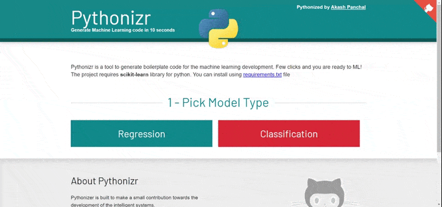
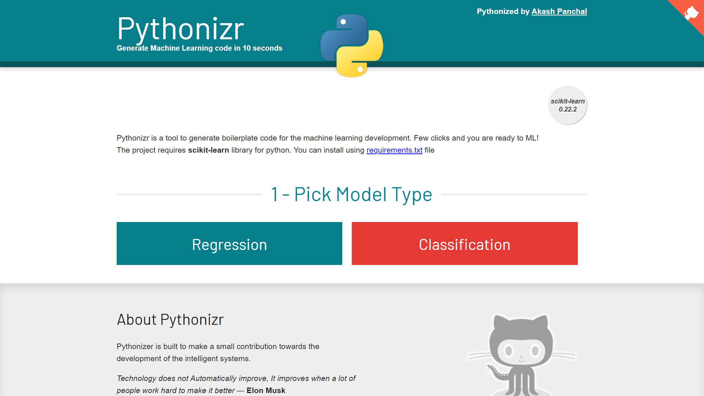
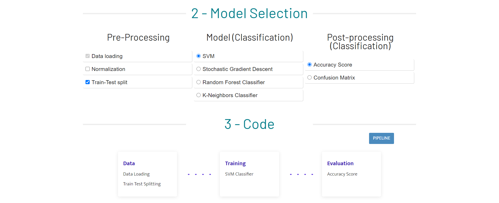
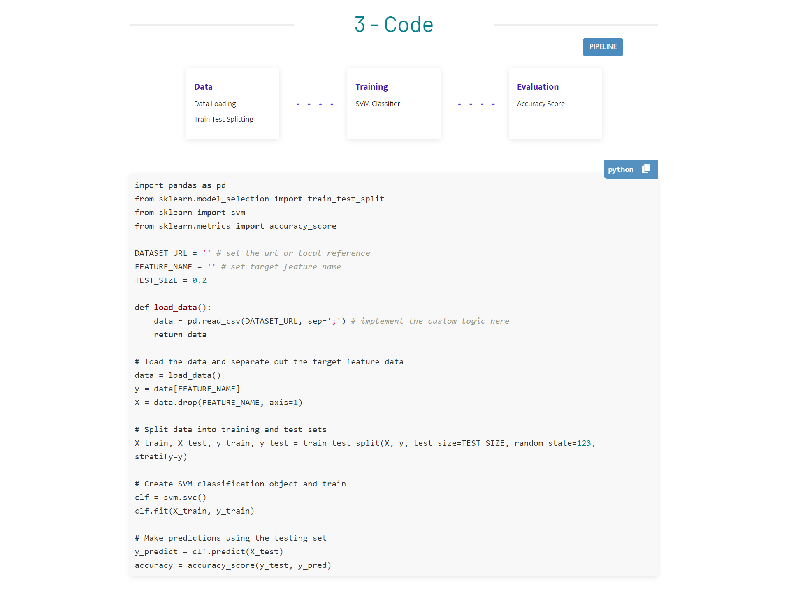

# ML-Initializer - Machine Learning Code generator
## 

  <kbd>
</img>
  </kbd>

-----

* [Requirements](#requirements)
* [Installation](#installation)
* [Language And Tools](#language-and-tools)
* [License](#license)

### Requirements
This project does not require any special tools or libraries. 
A computer, and a web browser of your choice.

### Installation
This is a static HTML website project, no installation requires to run this project. 
Just download or clone it locally and run the `index.html` file.

### Language And Tools
#### HTML

HTML5

#### JavaScript

- Vanilla Javascript
- [jquery](https://jquery.com/)
- [highilighjs](https://highlightjs.org/) for code highlighting
- [highlightjs-badge](https://github.com/RickStrahl/highlightjs-badge)

#### CSS

- Vanilla CSS

-----

## Walkthrough

### 1. Select the Approach

 
### 2. Configure

  
### 3. Code is ready

## License

